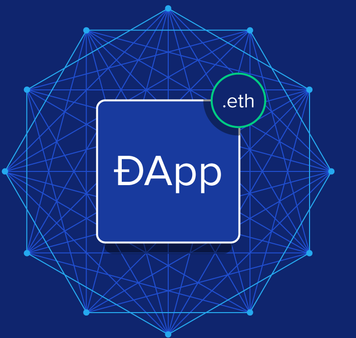

This is a [Next.js](https://nextjs.org/) project bootstrapped with [`create-next-app`](https://github.com/vercel/next.js/tree/canary/packages/create-next-app).

## full-stack Next.js application using the Ethereum ecosystem

###a web app that will allow you to create an on-chain mechanical keyboard, view other users' keyboards, and send an ETH tip to your favorites!

# Click here to visit dapp 

